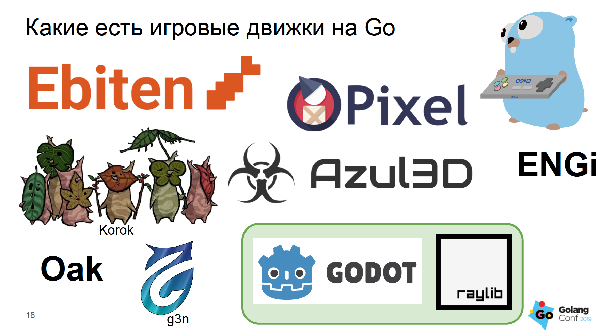
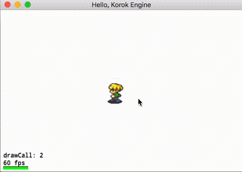
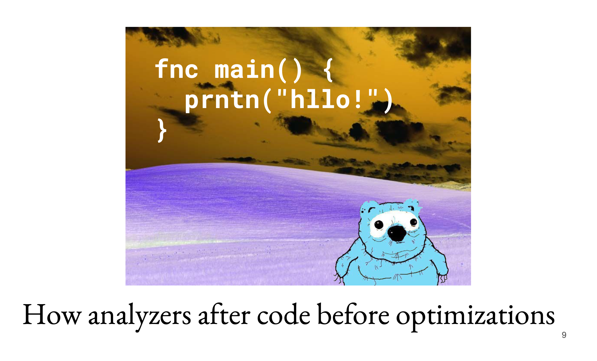
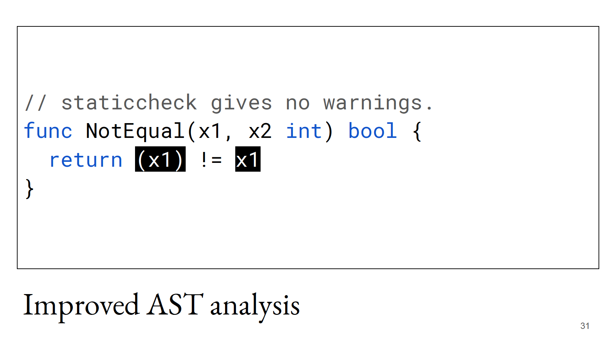
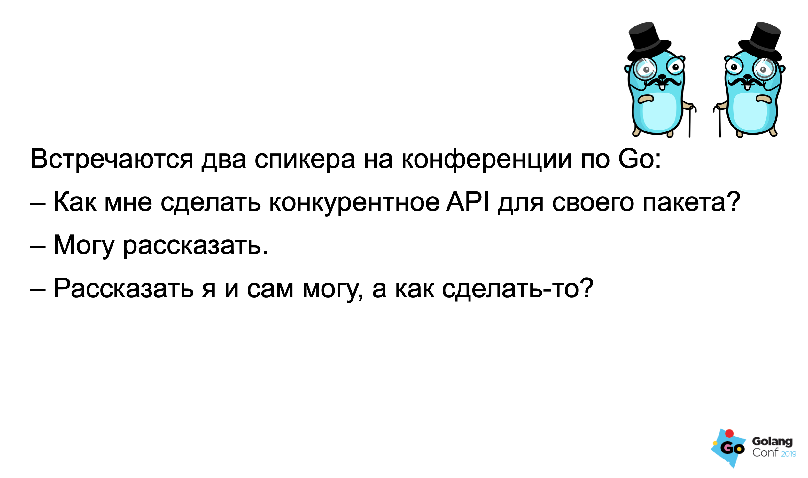
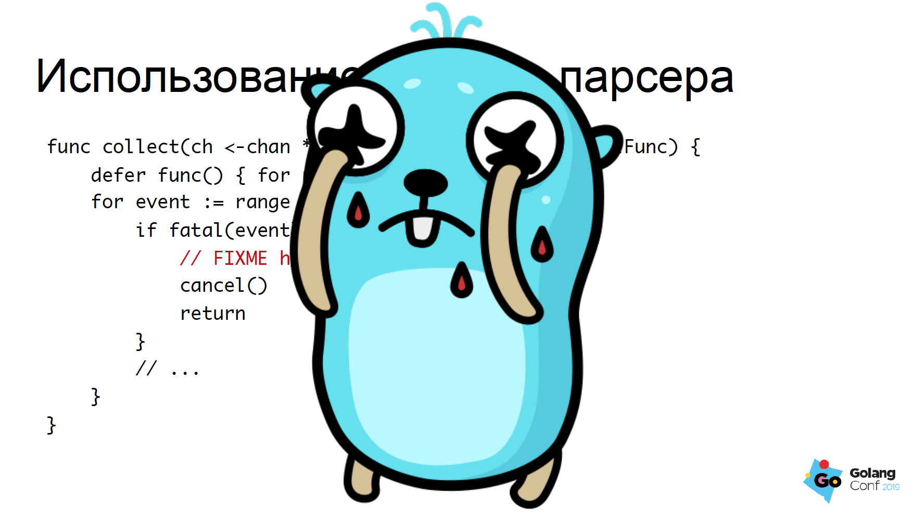
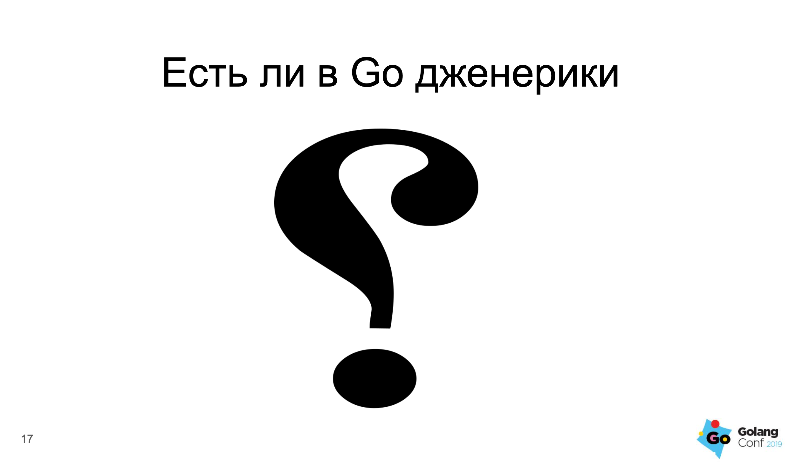

# GolangConf 2019

Created: Oct 09, 2019 11:52 PM
Tags: Media,golang,it,thoughts
---

В понедельник 7 октября прошла конференция GolangConf 2019.

Жаль, что физически невозможно находиться в нескольких местах одновременно, и вдвойне жаль, что мне пришлось уйти до начала доклада Фила "Эшер II" Кулина  — с нетерпением жду видеоматериалов!

Дальше будет краткий обзор докладов, которые мне особенно запомнились — но надо понимать, что список далеко не полный, и порядок в нём не означает ничего :3

## Go делать игры!

Алексей Акулович

Большая часть доклада — обзор игровых движков в контексте экосистемы Go. 

К сожалению, с этим направлением у гофера не очень — большая части проектов мертва или впала в коматозное неподдерживаемое состояние. 

Поддерживаемые проекты страдают от очень скудной документации и малого количества примеров — впрочем это не удивительно, если принимать во внимание микроскопическую аудиторию этих пакетов. 

> Korok — кроссплатформенный движок с поддержкой в том числе и iOS. Есть минимальная поддержка анимаций и даже простой физики — но увы, похоже что проект умирает [https://github.com/KorokEngine/Korok](https://github.com/KorokEngine/Korok)

Мне прежде всего этот доклад был интересен с точки зрения использования Go в браузере через WASM — но и тут радоваться особенно нечему. Те немногие движки, которые обещают поддержку браузера, очень плохо оптимизированы под такую среду выполнения — например, для декодирования структур используют пакет `image/*`, из-за чего безбожно тормозят на запуске, пытаясь прогнать сотни изображений через стандартный png парсер. В общем и целом, использовать Go для фронтовых приложений пока не очень хорошая идея

Тем не менее, на десктопе ситуация не столь плачевна — есть пара вполне приличных проектов — биндинги к [raylib](https://github.com/gen2brain/raylib-go) и [godot](https://github.com/ShadowApex/godot-go), которые, хотя и не могут похвастаться хоть какой-то эффективностью, вполне сгодятся для ваших петрпроджектов. 

Ссылка на презентацию: [ater.me/conf/goc19.pptx](http://ater.me/conf/goc19.pptx)

## Applied Go code similarity analysis

Очень интересный доклад от Искандера Шарипова, который может стать первой ласточкой нового поколения инструментов для статического анализа кода. 

Одна из основных проблем существующих линтеров в экосистеме Golang — это использование AST представления кода, из которого довольно сложно извлечь семантику (в том числе и информацию о типах). На практике это приводит к тому, что конструкции, делающие одну и ту же работу, с точки зрения линтера могут выглядеть совершенно по-разному. В некоторых случаях даже простое переупорядочивание выражений или использование дополнительных скобок запутывает анализатор или приводит к ложнополодительным срабатываниям.

Искандер предлагает довольно изящное решение, которое не потребуют сильной модификации большинства существующих линеров — нормализация структуры кода и приведения его к какому-то единообразному, каноническому виду перед тем, как проводить анализ с помощью эвристик линтера. Разумеется, речь не идёт о том, чтобы переформатировать уже написанный код, проще всего встроить нормализатор в конвейер обработки кода в какой-нибудь из металинтеров (наподобие [golangci-lint](https://github.com/golangci/golangci-lint)). В процессе нормализации предполагается синтезировать карту отображения позиций нормализованного кода на оригинальные исходники и проводя обратное преобразование при выдачи результатов.

Неполный список нормализаций примерно таков:

- замена констант на их значения;
- замена вызовов чистых функций на аналогичные (например `fmt.Sprintf("%d", 42) ⇒ strconv.Itoa(42)`);
- уничтожение скобочек;
- замена цепочек `if - else if - else` на `switch`;

Ещё мне понравилась идея анализа небольших функций с использованием деструктивной нормализации (с нарушением синтаксиса) их тела и использованием инструментов типа Elastic Search для создания индексов полнотекстового поиска. Если справедливо предположение о том, что короткие куски кода, написанные одинаково, делают примерно одни и те же вещи, мы сможем очень хорошо искать интересные с точки зрения статического анализа функции — например, велосипеды, дублирующие функционал стандартной библиотеки.

Из рубрики #хозяйкеназаметку — утилита [gogrep](https://github.com/mvdan/gogrep), которая умеет ходить по AST Golang и применять к узлам регулярные выражения.

Мне кажется следующим логичным шагом стало бы создание пакета для построения "типизированного AST", в котором бы низкоуровневые конструкции типа `if-else` и `switch` выражались бы обобщённой абстракцией ветвления и так далее, но, как правильно заметил Искандер, это потребовало бы больших трудозатрат, чем относительно простые трансформаторы AST.

Библиотека алгоритмов нормализации: [github.com/quasilyte/astnorm](http://github.com/quasilyte/astnorm)

## Как ошибиться с конкурентностью в Go

Огненный доклад Алексея Палажченко о том как не надо делать API для вашей библиотеки. Основные идеи:

1. Избегайте асинхронных интерфейсов, если вас совсем не припрёт. 
2. Не доверяйте слепо авторитетам. Если вам нужно — делайте асинхронный API.

В качестве примера Алексей взял парсер логов MySQL, для которого у многих руки скорее всего зачешутся написать что-то типа такого

Проблема в том, что для работы с таким объектом вам придётся озаботиться о куче вещей, начиная об отмене контекста и заканчивая вычиткой сообщений из пустого канала — слишком много бойлерплейта.

Делайте скучное, блокирующее API! Пользователям не составит труда сделать асинхронную обёртку, если они захотят — в Go это не сложно. Скорее всего в большинстве случаев ваш объект будут использовать как раз в вполне себе в синхронном виде — так что не стоит усложнять людям и себе жизнь.

## Дженерики в Go

Доклад в жанре наброса от Ильи Глухова! В основном обзорный. 

Этот доклад меня прежде всего порадовал не глубоким, но широким анализом разных подходов метапрограммирования в популярных языках, а так же осторожной оценкой последствий введения дженериков в Go.

Ключевые моменты:

- Какие задачи дженерики решают в других языках?
- Какие задачи они должны будут решать в Go?
- А как мы решаем эти проблемы сейчас (смотри embedded, интерфейсы и пакет `sort`)?
- А что понимают под дженериками авторы текущего и пока самого успешного [пропоузала](https://go.googlesource.com/proposal/+/4a54a00950b56dd0096482d0edae46969d7432a6/design/go2draft-contracts.md)?

Как по мне, так я с радостью отказался бы от дженериков в Go, будь у нас что-то по-лучше для кодогенерации, чем просто вызов команды через шелл из комментария в коде.

Текущее состояние дел с дженериками/контрактами:

- реализации в виде куска тулчейна пока нет;
- синтаксис контрактов пока не устоялся;
- но зато это самая крупная движуха в сторону метапрограммирования за всю историю Go и её активно пушит сообщество;

## Не IT

Очень порадовал аспект конференции, напрямую не связанный с докладами. Конечно же, третий мотиватор сходить на конференцию, кроме общения и докладов — это мерч, с которым на GolangConf было очень в порядке. 

К тому же я выиграл две книги за удачно заданные вопросы — что не может не радовать моего внутреннего коллекционера кирпичей из пресованных мёртвых деревьев. 

## Материалы

Видео докладов должны быть опубликованы здесь через пару недель (на данный момент там пустота, но я конечно же подписался):

[https://www.youtube.com/channel/UCykb1JeHJvVHOL6XJCoWMdA](https://www.youtube.com/channel/UCykb1JeHJvVHOL6XJCoWMdA)
